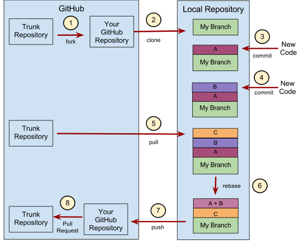

## 技术

### 程序员必读书目（单）
- https://baijiahao.baidu.com/s?id=1564092687048361&wfr=spider&for=pc
- https://www.jianshu.com/p/963973835545

### [深入浅出nodejs作者前端技能汇总，包括推荐的书籍](https://github.com/JacksonTian/fks)

### [2020年3月最受欢迎的10个CSS项目](https://mp.weixin.qq.com/s/v9K_NzMCofqZrwQ8WMCV0A)

## 唤醒qq聊天窗口
  window.open(`http://wpa.qq.com/msgrd?v=3&uin=${qidianNumber}&site=qq&menu=yes`)
  移动端h5： window.open(`mqqwpa://im/chat?chat_type=wpa&uin=${qqNumber}&version=1&src_type=web&web_src=oicqzone.com`);
 window.open(`tencent://Message/?Uin=${qidianNumber}&amp;websiteName=qtrade.com.cn&amp;Menu=yes`)

## git技巧


- [常用git命令清单](http://www.ruanyifeng.com/blog/2015/12/git-cheat-sheet.html)
- 删除文件
```bash
# 删除工作区文件，并且将这次删除放入暂存区
$ git rm [file1] [file2] ...

# 停止追踪指定文件，但该文件会保留在工作区
$ git rm --cached [file]

# 改名文件，并且将这个改名放入暂存区
$ git mv [file-original] [file-renamed]
```
- 查看信息
```bash
# 显示有变更的文件
$ git status

# 显示当前分支的版本历史
$ git log

# 显示commit历史，以及每次commit发生变更的文件
$ git log --stat

# 搜索提交历史，根据关键词
$ git log -S [keyword]

# 显示某个commit之后的所有变动，每个commit占据一行
$ git log [tag] HEAD --pretty=format:%s

# 显示某个commit之后的所有变动，其"提交说明"必须符合搜索条件
$ git log [tag] HEAD --grep feature

# 显示某个文件的版本历史，包括文件改名
$ git log --follow [file]
$ git whatchanged [file]

# 显示指定文件相关的每一次diff
$ git log -p [file]

# 显示过去5次提交
$ git log -5 --pretty --oneline

# 显示所有提交过的用户，按提交次数排序
$ git shortlog -sn

# 显示指定文件是什么人在什么时间修改过
$ git blame [file]

# 显示暂存区和工作区的差异
$ git diff

# 显示暂存区和上一个commit的差异
$ git diff --cached [file]

# 显示工作区与当前分支最新commit之间的差异
$ git diff HEAD

# 显示两次提交之间的差异
$ git diff [first-branch]...[second-branch]

# 显示今天你写了多少行代码
$ git diff --shortstat "@{0 day ago}"

# 显示某次提交的元数据和内容变化
$ git show [commit]

# 显示某次提交发生变化的文件
$ git show --name-only [commit]

# 显示某次提交时，某个文件的内容
$ git show [commit]:[filename]

# 显示当前分支的最近几次提交
$ git reflog
```
- 撤销 回滚
```bash
# 恢复暂存区的指定文件到工作区
$ git checkout [file]

# 恢复某个commit的指定文件到暂存区和工作区
$ git checkout [commit] [file]

# 恢复暂存区的所有文件到工作区
$ git checkout .

# 重置暂存区的指定文件，与上一次commit保持一致，但工作区不变
$ git reset [file]

# 重置暂存区与工作区，与上一次commit保持一致
$ git reset --hard

# 重置当前分支的指针为指定commit，同时重置暂存区，但工作区不变
$ git reset [commit]

# 重置当前分支的HEAD为指定commit，同时重置暂存区和工作区，与指定commit一致
$ git reset --hard [commit]

# reset之后强制推到远程分支，一定要小心使用这个，因为它将强制覆盖远程分支内容
$ git push -f

# 重置当前HEAD为指定commit，但保持暂存区和工作区不变
$ git reset --keep [commit]

# 新建一个commit，用来撤销指定commit
# 后者的所有变化都将被前者抵消，并且应用到当前分支
$ git revert [commit]

# 暂时将未提交的变化移除，稍后再移入
$ git stash
$ git stash pop
```
- git其他操作
```bash
# 生成一个可供发布的压缩包
$ git archive
```

- [远程覆盖本地](https://blog.csdn.net/lorkoy/article/details/50404407)
  - git fetch --all
  - git reset --hard origin/master
- git vsCode git 操作提示 Permission denied, please try again
 ssh-add ~/.ssh/id_rsa
- 合并代码
  - 提交修改代码到本地仓库，$ git commit -m "修改的东西的描述"
  - 切换到master主分支上，$ git checkout master
  - 拉取主分支上面的代码，$ git pull origin master
  - 切换到自己的分支，$ git checkout lbh
  - 将master主分支上的代码合并到当前分支，$ git merge master
  - 将本地的 lbh 分支推送至远端的 lbh分支，如果没有就新建一个，$ git push origin lbh
- 创建分支
  - 切换到master， git checkout master, 同时获取最新代码，git pull
  - 基于当前master创建分支， git branch test(or git checkout -b test)
  - 当前分支推送到远程分支，git push origin test，或者git push origin test(本地分支名):test(远程分支名)
- git merge一个指定文件, 从别的分支合并某个文件到当前分支
  - git checkout other-branch（别的分支名）  xxxx（文件名）
- 提交代码
  - git add .
  - git commit -m "commit information"
  - git push
- 打tag
  - 切换到base分支，比如 git checkout master
  - 本地打tag, git tag -a tagName -m "comment info"
  - 查看本地tag， git show tagName
  - 推送到远程服务器 git push origin tagName
  - 删除本地tag, git tag -d tagName
  - 删除远程分支， git push origin :refs/tags/tagName
- 查看所有分支
  - 本地分支和远程分支 git branch -a
  - 本地分支 git branch
- 删除分支
  - 删除本地分支
    - 当前分支不能是要删除的分支，要先切换到别的分支，比如master分支 git checkout master
    - 删除本地分支即可 git branch -d need-delete-branch-name
  - 删除远程分支
    - git push origin :test  or  git push origin --delete test
- 更新submodule
  -  初始化本地配置文件，$ git submodule init
  -  检出父仓库列出的commit，$ git submodule update
- [如何撤销 Git 操作](http://www.ruanyifeng.com/blog/2019/12/git-undo.html)

### git注意事项和错误及解决方案
- [git clone 提示 fatal: unable to access  SSL certificate problem: self signed certificate  ](https://blog.csdn.net/qibobo/article/details/43527595)
  - git clone 提示 fatal: unable to access  SSL certificate problem: self signed certificate  
  - 解决方法是：git config --global http.sslVerify false
- 

## 缓存
- [前端清理缓存](https://stackoverflow.com/questions/49547/how-do-we-control-web-page-caching-across-all-browsers)
  ```<meta charset='UTF-8'>
        <meta name="renderer" content="webkit">
    <meta http-equiv="X-UA-Compatible" content="IE=edge">
        <meta http-equiv="Cache-Control" content="max-age=0, no-cache, no-store, must-revalidate">
    <meta http-equiv="Pragma" content="no-cache">
        <meta http-equiv="Expires" content="-1">
- nginx配置缓存
  ```location ~* \.(?:html|htm)$ {  
   add_header "Cache-Control" "max-age=0, no-cache, no-store, must-revalidate";
  add_header "Pragma" "no-cache";
  add_header "Expires" "-1";
}

### 搜索技巧
- 搜索关键字，指南，流程，教程

## 教程
- [人工智能简介](https://course.elementsofai.com/)


## 阮一峰技术博客
- 事实上，今天任何一家公司都可以自建像亚马逊一样的网店。在美国，你可以使用 Shopify 建店，在社交媒体做广告，使用 Stripe 处理支付，通过 ShipBob 管理库存和订单，用 Returnly 处理退货，用 DarkStore 提供当日送货服务。这些 SaaS 服务的成本只需要几百美元，让你可以向消费者提供跟亚马逊一样的服务。
- [playwright](https://github.com/microsoft/playwright)
  - 一个支持 Chrome、Safari、Firefox、Edge 的浏览器自动化工具，即一个自动化脚本对所有浏览器都有效，由 Puppeteer 团队出品。
- [开源的短链接生成器，基于 Node.js，允许自定义短链接、设置链接密码，还提供访问统计](https://github.com/thedevs-network/kutt)
- [一个 JavaScript 语言的 OCR 库，可以在网页运行，识别图片中的文字。它支持100多种文字，包括中文。](https://github.com/naptha/tesseract.js)
  - [这里还有一篇教程，介绍 Python 语言如何使用这个库。](https://nanonets.com/blog/ocr-with-tesseract/) 
- [中文的密码学入门介绍，向非专业读者介绍了密码学的基本概念，没有涉及到技术细节。](https://learning.nervos.org/crypto-block/0-intro.html)
- [顶部进度条,一个网页顶部进度条的 JS 库](https://github.com/vortesnail/qier-progress)
- [一个基于 Python 的开源金融数据接口库，目的是实现股票、期货等金融产品从数据采集、数据清洗到数据下载的工具，满足金融数据科学家、数据科学爱好者在数据获取方面的需求](https://github.com/jindaxiang/akshare)
- [HTML 源码转换为 Markdown 的 JS 库，可以定制规则](https://github.com/mdnice/sitdown)
- [一个在线生成数学函数图形的网页小工具](https://helloacm.com/tools/math-plot-graph/)
- [一个 Python 代码的加密器，可以防止别人看脚本源码](https://github.com/ga0/pyprotect)
- [es2020新特性](https://alligator.io/js/es2020/)
- [前端面试复习笔记](https://github.com/CavsZhouyou/Front-End-Interview-Notebook)
- [无线电波的历史](http://www.ruanyifeng.com/blog/2006/08/the_story_of_marconi.html)
- [现代医学200年，新英格兰医学杂志](http://www.ruanyifeng.com/blog/2012/01/modern_medicine_timeline.html)
- [如何用网页脚本追踪用户](http://www.ruanyifeng.com/blog/2019/04/user-tracking.html)
- [只需要5秒的真人语音，就可以提取语音特征，然后任何文本都可以转成该人的语音](https://google.github.io/tacotron/publications/speaker_adaptation/)
- [浏览器禁用三方 Cookie 的分析](https://juejin.im/post/5e97124df265da47b27d97ff)
- [一个纯 CSS 库，提供各种形状的背景图案](https://bansal.io/pattern-css)
- [另一个纯 CSS 库，提供各种形状的背景图案](http://www.heropatterns.com/)
- [Web Worker 使用教程](http://www.ruanyifeng.com/blog/2018/07/web-worker.html)
- [浏览器数据库indexedDB](http://www.ruanyifeng.com/blog/2018/07/indexeddb.html)
- [Node 调试工具入门教程,chrome浏览器调试node](http://www.ruanyifeng.com/blog/2018/03/node-debugger.html)
- [node事件循环 node-event-loop](http://www.ruanyifeng.com/blog/2018/02/node-event-loop.html)
- [Ramda 函数库参考教程](http://www.ruanyifeng.com/blog/2017/03/ramda.html)
- [npm scripts 使用指南](http://www.ruanyifeng.com/blog/2016/10/npm_scripts.html)
- [Node.js 命令行程序开发教程](http://www.ruanyifeng.com/blog/2015/05/command-line-with-node.html)
- [字符编码笔记：ASCII，Unicode 和 UTF-8](http://www.ruanyifeng.com/blog/2007/10/ascii_unicode_and_utf-8.html)
- [关于Unix哲学,软件开发的原则](http://www.ruanyifeng.com/blog/2009/06/unix_philosophy.html)
- [互联网协议五层架构1](http://www.ruanyifeng.com/blog/2012/05/internet_protocol_suite_part_i.html)
- [互联网协议五层架构2](http://www.ruanyifeng.com/blog/2012/06/internet_protocol_suite_part_ii.html)
- 代码抽象原则
  - 一个函数或模块只做一件事情，复杂功能通过组合实现，少用继承
  - 不要重复自己，抽象化
  - 不要复杂化，尽快让软件运行起来
  - 2，3有冲突，可行性方案是重复三次以上才抽象化提取封装
- [DNS 原理入门 DNS查找](http://www.ruanyifeng.com/blog/2016/06/dns.html)
- [黑白照片变成彩色照片，照片着色，照片彩色化](https://colorize.cc/)
- [语种名称代码,语言包标识](http://www.ruanyifeng.com/blog/2008/02/codes_for_language_names.html)
- [OWASP安全开发指南](https://github.com/OWASP/DevGuide)
- [HTML Email 编写指南, 邮件中潜入html](http://www.ruanyifeng.com/blog/2013/06/html_email.html)
- [css动画介绍](http://www.ruanyifeng.com/blog/2014/02/css_transition_and_animation.html)
- [理解OAuth 2.0授权](http://www.ruanyifeng.com/blog/2014/05/oauth_2_0.html)
- [RESTful API 设计指南](http://www.ruanyifeng.com/blog/2014/05/restful_api.html)
- [RESTful API 设计指南](http://www.ruanyifeng.com/blog/2014/05/restful_api.html)
- [MVC，MVP 和 MVVM 的图示](http://www.ruanyifeng.com/blog/2015/02/mvcmvp_mvvm.html)
- [随机输出格言](http://www.ruanyifeng.com/blog/2015/04/fortune.html)
- [git flow git提交流程](http://www.ruanyifeng.com/blog/2015/08/git-use-process.html)
- [Emoji简介，Emoji编程，Emoji嵌入](http://www.ruanyifeng.com/blog/2017/04/emoji.html)
- [双因素认证（2FA）教程](http://www.ruanyifeng.com/blog/2017/11/2fa-tutorial.html)
- [bash脚本set命令教程](http://www.ruanyifeng.com/blog/2017/11/bash-set.html)
- [DDOS 攻击的防范教程](http://www.ruanyifeng.com/blog/2018/06/ddos.html)
- [命令行通配符教程](http://www.ruanyifeng.com/blog/2018/09/bash-wildcards.html)
- [Page Lifecycle API 教程，页面生命周期，网页生命周期](http://www.ruanyifeng.com/blog/2018/11/page_lifecycle_api.html)
- [找回密码的功能设计](http://www.ruanyifeng.com/blog/2019/02/password.html)
- [普通人的网页配色方案](http://www.ruanyifeng.com/blog/2019/03/coloring-scheme.html)
- [CSS Grid 网格布局教程](http://www.ruanyifeng.com/blog/2019/03/grid-layout-tutorial.html)
- [GitHub OAuth 第三方登录示例教程](http://www.ruanyifeng.com/blog/2019/04/github-oauth.html)
- [一个适用于中小企业的轻量级服务器自动化运维管理平台，界面为中文。功能包含主机管理、主机批量执行、主机在线终端、应用发布部署、端口监控、报警等](https://github.com/openspug/spug)
- [定价心理学，定价策略，定价技巧](https://www.nickkolenda.com/psychological-pricing-strategies/)
- [Nginx 的图形配置界面，点几下鼠标，自动生成配置文件，可以上传到服务器](https://www.digitalocean.com/community/tools/nginx)
- [一个在线编写幻灯片的服务](https://deckdeckgo.com/)
- [Leetcode 前 300 题，每道都进行了详细通俗的分析，并且提供多种思路解法](https://leetcode.wang/)
- [如何分析照片的地理信息](https://www.secjuice.com/geolocation-osint-amateur-hour/)
- [如何用链判断运算符?.重构代码](https://lea.verou.me/2020/06/refactoring-optional-chaining-into-a-large-codebase-lessons-learned/)
- [KeePass：最安全的密码管理器](https://www.rmnof.com/article/keepass-password-manager/)
- [DNS 查询的原理](https://jvns.ca/blog/how-updating-dns-works/)
- [CSS 三角形生成器](https://www.dute.org/css-arrow)
- [Scroll to text fragment 生成器，自动滚动到指定文字](https://github.com/chunliu/sttf-url-generator)
- [网页录屏器，但是生成的录像文件的体积远远小于传统视频](https://github.com/oct16/TimeCat)
- [根据用户的唯一 ID，自动生成头像图片的 JS 库](https://github.com/loweisz/generate-avatar)
- [施普林格的免费书籍](https://hnarayanan.github.io/springer-books/#Computer%20Science)
- [电梯效果滚动到顶部](https://github.com/tholman/elevator.js)
- [一个纯前端的在线图片格式转换工具，可以快速将图片转为另一种格式，并且提供多个参数可以调节](https://github.com/renzhezhilu/webp2jpg-online)
- [一个在线的项目管理软件，用于 Bug 管理，比 Jira 用法简单](https://linear.app/)
- [如何不靠运气变得富有](https://github.com/taosue/how-to-get-rich-without-getting-lucky/)
- [前端word to HTML, 前端处理zip, 前端word to markdown, 前端生成word文档](https://mp.weixin.qq.com/s/_Y7V5KQrf0VF6KVTNqAljA)
- [前端处理word文档，Mammoth.js把word文档转换成html，markdown，Text](https://github.com/mwilliamson/mammoth.js)
- [前端处理zip文件，JSZip 是一个用于创建、读取和编辑 「.zip」 文件的 JavaScript 库](https://github.com/Stuk/jszip)
- [前端读写excel数据到XLSX and JSON](https://github.com/exceljs/exceljs)
- [前端动态生成word文档， html to word文档](https://github.com/evidenceprime/html-docx-js)
- [LeetCode 的解答, 力扣解答](http://www.herbert.top:18080/leetcode/)
- [该网站提供一系列可以在线使用的 AI 工具，比如识别物体、识别手写数字、老照片着色、绘画生成等等](https://www.gradio.app/hub)
- [面试算法小抄，leetcode，动态规划，数据结构，算法思维](https://labuladong.gitbook.io/algo/)
- [css渐变代码片段](https://www.gradientmagic.com/)
- [任何文本实现3D效果ztext.js](https://bennettfeely.com/ztext/)
- [通过一段加密文本判断使用的加密算法，使用人工智能算法](https://github.com/Ciphey/Ciphey)
- [各种好用的在线工具](https://github.com/zhaoolee/OnlineToolsBook)
- [一个开源的在线工具，可以为小视频加上水印图片](https://shotstack.io/demo/watermarker/)
- [该网站提供 Youtube 上面没有版权保护的背景音乐下载](https://mugle.io/)
- [该网站收集各种常用的正则表达式，比如搜索"email"，会返回961个正则表达式](https://regexlib.com/)
- [正则表达式图形化，帮助更好的理解正则表达式](https://jex.im/regulex/#!flags=&re=%5E(a%7Cb)*%3F%24)
- [markdown转pdf，markdown to pdf](https://github.com/BlueHatbRit/mdpdf)
- [计算机教育中缺失的一课, 各种命令行，文本编辑器等等各种工具](https://missing-semester-cn.github.io/)
- [一个简易的HTML Editor](https://no-gravity.github.io/html_editor/)
- [vue3源码分析](https://github.com/cuixiaorui/mini-vue)
- [IT初学者教程](https://learn.freecodecamp.one/)

## 前端开发

### 技术博客
- [倔金腾讯IVWEB团队](https://juejin.im/user/5a9f77666fb9a028c14a01eb)
- [知乎purerender](https://zhuanlan.zhihu.com/purerender)
- [知乎精读前端](https://zhuanlan.zhihu.com/FrontendPerusal)

### 工具及工程化
- gitlab
- jinkens
- webpack
- react react-router react-redux mobx
- [淘宝镜像配置，node-sass](https://github.com/kycool/common-config/blob/main/npm-mirror-config.md)
```
vi file in ~/.npmrc
这里使用了淘宝镜像，添加以下内容到文件中
registry=https://registry.npm.taobao.org
disturl=https://npm.taobao.org/dist
chromedriver-cdnurl=https://npm.taobao.org/mirrors/chromedriver
couchbase-binary-host-mirror=https://npm.taobao.org/mirrors/couchbase/v{version}
debug-binary-host-mirror=https://npm.taobao.org/mirrors/node-inspector
electron-mirror=https://npm.taobao.org/mirrors/electron/
flow-bin-binary-host-mirror=https://npm.taobao.org/mirrors/flow/v
fse-binary-host-mirror=https://npm.taobao.org/mirrors/fsevents
fuse-bindings-binary-host-mirror=https://npm.taobao.org/mirrors/fuse-bindings/v{version}
git4win-mirror=https://npm.taobao.org/mirrors/git-for-windows
gl-binary-host-mirror=https://npm.taobao.org/mirrors/gl/v{version}
grpc-node-binary-host-mirror=https://npm.taobao.org/mirrors
hackrf-binary-host-mirror=https://npm.taobao.org/mirrors/hackrf/v{version}
leveldown-binary-host-mirror=https://npm.taobao.org/mirrors/leveldown/v{version}
leveldown-hyper-binary-host-mirror=https://npm.taobao.org/mirrors/leveldown-hyper/v{version}
mknod-binary-host-mirror=https://npm.taobao.org/mirrors/mknod/v{version}
node-sqlite3-binary-host-mirror=https://npm.taobao.org/mirrors
node-tk5-binary-host-mirror=https://npm.taobao.org/mirrors/node-tk5/v{version}
nodegit-binary-host-mirror=https://npm.taobao.org/mirrors/nodegit/v{version}/
operadriver-cdnurl=https://npm.taobao.org/mirrors/operadriver
phantomjs-cdnurl=https://npm.taobao.org/mirrors/phantomjs
profiler-binary-host-mirror=https://npm.taobao.org/mirrors/node-inspector/
puppeteer-download-host=https://npm.taobao.org/mirrors
python-mirror=https://npm.taobao.org/mirrors/python
rabin-binary-host-mirror=https://npm.taobao.org/mirrors/rabin/v{version}
sass-binary-site=https://npm.taobao.org/mirrors/node-sass
sodium-prebuilt-binary-host-mirror=https://npm.taobao.org/mirrors/sodium-prebuilt/v{version}
sqlite3-binary-site=https://npm.taobao.org/mirrors/sqlite3
utf-8-validate-binary-host-mirror=https://npm.taobao.org/mirrors/utf-8-validate/v{version}
utp-native-binary-host-mirror=https://npm.taobao.org/mirrors/utp-native/v{version}
zmq-prebuilt-binary-host-mirror=https://npm.taobao.org/mirrors/zmq-prebuilt/v{version}
```
- 装饰器
- [git学习路径](https://learngitbranching.js.org/)
- [nginx安装配置](https://www.runoob.com/linux/nginx-install-setup.html)
- [跨平台错误日志系统sentry]
  - [官网](https://sentry.io/welcome/)
  - [github](https://github.com/getsentry/sentry-javascript)
- [录屏软件，evcapture](https://www.ieway.cn/evcapture.html)
- [gif录屏工具，录屏软件，在百度网盘software文件夹中](http://xiazai.zol.com.cn/detail/45/446880.shtml)
- [Mocha、Ava、Jest 是目前非常流行的三大 JavaScript 测试框架，本文对它们进行了比较，每个框架最合适的运行场景。](https://github.com/scraggo/comparing-javascript-test-runners/blob/master/README.md)
- [本文用清晰的图形解释了五种 Git 工作流程，比如上图是 master - develop - feature 的工作流程](https://zepel.io/blog/5-git-workflows-to-improve-development/) 
- [一个网页表格库，类似 Excel 的效果。](https://github.com/mengshukeji/Luckysheet)
- [一个开源的富文本编辑器，功能丰富。](https://github.com/acccco/zebra-editor-core)
- [这个网站提供一个 API，可以让你定制想要的随机数据，以 JSON 格式返回。](https://random-data-api.com/)
- [一个 SVG 图片（主要是图标）的搜索引擎。](https://www.svgrepo.com/)
- [微前端](https://juejin.im/post/6864381092061773831)


### webapi
- [javascript event keycodes事件按键码值](http://keycode.info/)

### [配置html5 history模式路由](https://router.vuejs.org/zh/guide/essentials/history-mode.html)
- Apache
```
<IfModule mod_rewrite.c>
  RewriteEngine On
  RewriteBase /
  RewriteRule ^index\.html$ - [L]
  RewriteCond %{REQUEST_FILENAME} !-f
  RewriteCond %{REQUEST_FILENAME} !-d
  RewriteRule . /index.html [L]
</IfModule>
```
- nginx
```
location / {
  try_files $uri $uri/ /index.html;
}
```
- 原生node.js
```node
const http = require('http')
const fs = require('fs')
const httpPort = 80

http.createServer((req, res) => {
  fs.readFile('index.htm', 'utf-8', (err, content) => {
    if (err) {
      console.log('We cannot open "index.htm" file.')
    }

    res.writeHead(200, {
      'Content-Type': 'text/html; charset=utf-8'
    })

    res.end(content)
  })
}).listen(httpPort, () => {
  console.log('Server listening on: http://localhost:%s', httpPort)
})
```

### 类库
- [一个实现各类图形的 CSS 库](https://github.com/chokcoco/magicCss)
- custom react hooks
  - [精度Function Component](https://github.com/dt-fe/weekly/blob/v2/104.%E7%B2%BE%E8%AF%BB%E3%80%8AFunction%20Component%20%E5%85%A5%E9%97%A8%E3%80%8B.md)
  - [react use](https://github.com/chenky/react-use)
  - [@umijs/hooks](https://github.com/umijs/hooks)
    - [unijs/hooks教程说明](https://zhuanlan.zhihu.com/p/94030173)
- [128.精读《Hooks 取数 - swr 源码》.md](https://github.com/dt-fe/weekly/blob/v2/128.%E7%B2%BE%E8%AF%BB%E3%80%8AHooks%20%E5%8F%96%E6%95%B0%20-%20swr%20%E6%BA%90%E7%A0%81%E3%80%8B.md)
  - [github address](https://github.com/zeit/swr)
- [操作cookie类库，cookie.js](https://github.com/florian/cookie.js)
- [不同模块共享数据，通过订阅发布模式实现](https://github.com/yanhaijing/data.js)
- [javascript操作css3动画](http://visionmedia.github.io/move.js/)
- [方便操作键盘上每个键的键位码](http://dmauro.github.io/Keypress/)
- [检测用户的设备](https://github.com/joyqi/mobile-device-js)
- [类型检查检测](https://github.com/arasatasaygin/is.js)
- [快来试试这款非阻塞式，小清新的通知插件吧，对移动端有好，界面好到爆炸啊](https://github.com/jaredreich/notie)
- [一键分享到微博、QQ空间、QQ好友、微信、腾讯微博、豆瓣、Facebook、Twitter、Linkedin、Google+、点点等社交网站。](https://github.com/overtrue/share.js)
- [js自带的数学运算不能满足你的需求了，那试试这个，扩展了很多数学运算](https://github.com/josdejong/mathjs)
- [一个 Web Components 组件库，非常易用](https://shoelace.style/components/dropdown)
- [国内连接 npm 源服务器很慢，tbify 这个工具可以自动将 npm、yarn 等包管理工具连上国内的淘宝镜像，对工具和系统都是非侵入性的](https://github.com/fjc0k/tbify)
- [在线工具，让一张平面图片变成 3D 书籍封面](https://3d-book-css.netlify.app/)
- [谷歌发布的英文教程，没有高深的数学，向初学者介绍 TensorFlow 和深度学习](https://codelabs.developers.google.com/codelabs/cloud-tensorflow-mnist/)
- [一个只用 HTML 和 CSS 实现的扫雷游戏，不使用 JavaScript](https://github.com/propjockey/css-sweeper)
- [React 的表格组件库，新的 7.0 版完全采用 Hooks 设计](https://github.com/tannerlinsley/react-table)
- [fullpage.js, vue，react版本，全屏展示页面](https://github.com/alvarotrigo/fullpage.js)
- [跨浏览器兼容满屏API](https://github.com/sindresorhus/screenfull.js)
- [时间控件moment.js](https://momentjs.com/)
- [多点触摸类库](http://hammerjs.github.io/getting-started/)
- [根据垂直空间显示网格块](https://masonry.desandro.com/)
- [slick.js响应式，无限循环及更多功能的轮播组件](https://github.com/kenwheeler/slick)
- [React 的时间轴组件,react-chrono](https://github.com/prabhuignoto/react-chrono)
- [网页瀑布流的布局库,Masonry](https://masonry.desandro.com/)
- [一个命令行的视频处理工具，属于 FFmpeg 的包装库，提供简单易用的语法格式。](https://github.com/yuanqing/vdx)
- [Diode 可以将本机（localhost）的网站公开到互联网上，提供一个二级域名，使得外部用户可以访问。](https://support.diode.io/article/ss32engxlq)
- [一个在线电台，播放适合工作时收听的音乐，提供几个不同风格的频道，比如平静的音乐或有节奏感的音乐](https://deepwork.fm/)

### 前端进阶知识点
1. [惰性求值](https://zhuanlan.zhihu.com/p/26535479)
2. curry 化
3. 闭包
4. 高阶函数
5. 函数式编程
6. compose
7. 中间件
8. 依赖注入
9. flex和grid
10. 框架类库源码分析
11. [精读《Vue3.0 Function API》](https://zhuanlan.zhihu.com/p/71667382)
12. [精读《Function Component 入门》](https://zhuanlan.zhihu.com/p/67087685)
13. [一篇看懂 React Hooks](https://zhuanlan.zhihu.com/p/50597236)， [精读《React Hooks 最佳实践》](https://zhuanlan.zhihu.com/p/81752821)
14. promise, generator, async await
15. 数据结构与算法
16. [how to build your own react](https://pomb.us/build-your-own-react/)
17. [一个 TypeScript 写的 JavaScript 解析器，也就是说使用 JavaScript 解析 JavaScript，支持最新的 ES2020 语法](https://github.com/KFlash/seafox)

### 前端面试题
- [The-Best-Frontend-JavaScript-Interview-Questions](https://performancejs.com/post/hde6d32/The-Best-Frontend-JavaScript-Interview-Questions-%28written-by-a-Frontend-Engineer%29)

### 错误日志监控
- [百度统计（机型统计，品牌统计，系统统计，分辨率统计等等）](https://tongji.baidu.com/research/app#behavior)
- [跨平台错误日志系统sentry]
  - [官网](https://sentry.io/welcome/)
  - [github](https://github.com/getsentry/sentry-javascript)

### [移动端调试工具](https://github.com/dt-fe/weekly/blob/v2/011.%E7%B2%BE%E8%AF%BB%E5%89%8D%E7%AB%AF%E8%B0%83%E8%AF%95%E6%8A%80%E5%B7%A7.md)
- [eruda]
  - [官网](https://eruda.liriliri.io/)
  - [github](https://github.com/liriliri/eruda)

### Vue3.0
- [109.精读《Vue3.0 Function API》.md](https://github.com/dt-fe/weekly/blob/v2/109.%E7%B2%BE%E8%AF%BB%E3%80%8AVue3.0%20Function%20API%E3%80%8B.md)
- [尤雨溪上海2019.6.8vue conf](https://www.bilibili.com/video/av55553166?from=search&seid=1740725612314499650)
- [自己整理的脑图](https://naotu.baidu.com/file/9506ac745baf842d4bd035ccf367ab22)

## 终端命令
- [mac](https://www.jianshu.com/p/3291de46f3ff)
  - 批量创建文件夹，mkdir dir{1..20} 批量创建文件夹名字是dir1-dir20
  - 批量创建文件， touch file{..20}.js 批量创建文件名字是file1.js-file20.js
  - 批量删除空文件夹， rmdir dir{2..5} 如果非空文件夹需要使用  sudo rm -r -f dir{1..2}
  - 批量删除文件， rm file{1..5}.js
  - 单个文件重命名 mv 原名 新名， 如 mv 1.js 2.js  1.js->2.js
  - 批量重命名 for i in *.js; do mv $i ${i//.js/.html}; done
  - cd 跳转到某个目录
  - ls 查看目录下到文件

## 经济理财
- 17世纪荷兰郁金香泡沫，18世纪英国南海公司发行股票大骗局，其中大科学家牛顿就亏损了2万多英镑，相当于他10年总收入之和，1929-1933美国经济大萧条，1997-1998亚洲金融危机，2000-2001年互联网金融泡沫，2007-2008次贷危机。
