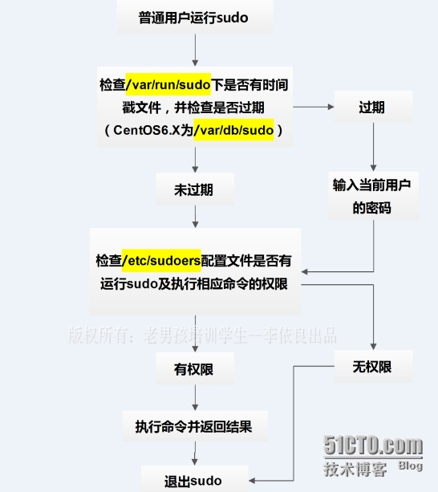

## linux 基础

- 1byte(1 个字节) = 8bit(0,1 二进制比特)
- 
- [-][rwx][r-x][r--]

  - 第一个中括号代表文档类型（d：目录，-：文件，l：link file，b：存储接口设备，c：串行端口设备如键盘鼠标）
  - 第二，三，四代表拥有人权限，群组权限，其他使用者权限
  - r：读， w：写， x：执行（与能否进入目录有关）
  - r：4 w：2 x：1
    owner = rwx = 4+2+1 = 7
    group = rwx = 4+2+1 = 7
    others= --- = 0+0+0 = 0
  - chgrp :改变档案所属群组
  - chown :改变档案所属人
  - chmod :改变档案的属性、 SUID 、等等的特性

  - (1)user (2)group (3)others 三群啦!那么我们就可以藉由 u, g, o 来代表三群的属性!此外， a 则代表 all 亦即全部的 三群
  - 
    - chmod u=rwx,go=rx .bashrc
    - 注意喔!那个 u=rwx,go=rx 是连在一起的，中间并没有任何空格符!
    - chmod a+w .bashrc(增加 .bashrc 这个档案的每个人均可写入的权限)
    - chmod a-x .bashrc(拿掉所有人的 x 的属性)

• cd:变换目录
• pwd:显示目前的目录
• mkdir:建立一个新的目录 • rmdir:删除一个空的目录


- linux 中创建者创建文件的最高默认权限是，目录 drwxrwxrwx(d777), 文件-rw-rw-rw-
- umask [S] [权限码（即上面的 u,g,o 每组权限码和排列）]

  - umask 获取默认权限掩码，如 022 表示 g,o 要减掉可写权限。

- chattr [+-=][asacdostu] 文件或目录 此命令可以修改文件或目录的属性，比如 S：同步写入磁盘，i：不允许删除， a：只能增加不能删除
  A :当设定了 A 这个属性时，这个档案(或目录)的存取时间 atime (access) 将不可被修改，可避免例如手提式计算机容易有磁盘 I/O 错误的情况发生!
  S :这个功能有点类似 sync 的功能!就是会将数据同步写入磁盘当中! 可以有效的避免数据流失!
  a :当设定 a 之后，这个档案将只能增加数据，而不能删除，只有 root 才能设定这个属性。
  c :这个属性设定之后，将会自动的将此档案『压缩』，在读取的时候将会自动解压缩， 但是在储存的时候，将会先进行压缩后再储存(看来对于大档案似乎蛮有用的!)
  d :当 dump(备份)程序被执行的时候，设定 d 属性将可使该档案(或目录)不具有 dump 功能
  i :这个 i 可就很厉害了!他可以让一个档案『不能被删除、改名、设定连结也无法写入
  或新增资料!』对于系统安全性有相当大的帮助!
  j :当使用 ext3 这个档案系统格式时，设定 j 属性将会使档案在写入时先记录在
  journal 中!但是当 filesystem 设定参数为 data=journalled 时，由于已经设定了
  日志了，所以这个属性无效!
  s :当档案设定了 s 参数时，他将会被完全的移除出这个硬盘空间。
  u :与 s 相反的，当使用 u 来设定档案时，则数据内容其实还存在磁盘中，
  可以使用来 undeletion.
- lsattr [-aR] 档案或目录
  -a :将隐藏文件的属性也秀出来;
  -R :连同子目录的数据也一并列出来!

- SUID,SGID,Sticky bit
  • 4 为 SUID
  • 2 为 SGID
  • 1 为 Sticky bit
- sudo命令权限原理
  - 在sudo於1980年前後被寫出之前，一般使用者管理系統的方式是利用 su 切換為超級使用者。但是使用su的缺點之一在於必須要先告知超級使用者的密碼。
  - sudo使一般使用者不需要知道超級使用者的密碼即可獲得權限。首先超級使用者將普通用戶的名字、可以執行的特定命令、按照哪種用戶或用戶組的身份執行等信息，登記在特殊的檔案中（通常是/etc/sudoers），即完成對該使用者的授權（此時該使用者稱為「sudoer」）[3]；在一般使用者需要取得特殊權限時，其可在命令前加上「sudo」，此時sudo將會詢問該使用者自己的密碼（以確認終端機前的是該使用者本人），回答後系統即會將該命令的行程以超級使用者的權限執行。之後的一段時間內（預設為5分鐘[4]，可在/etc/sudoers自訂），使用sudo不需要再次輸入密碼。
  - 


- whereis 与 locate 是利用数据库来搜寻数据，所以相当的快速，而且并没有实际的搜寻硬盘，比较省时间啦, find 是磁盘搜索慢呀
- which (根据 PATH，寻找『执行程序』) ， which [-a（将所有可以找到的指令均列出，而不止第一个被找到的指令名称）] command
- whereis [-bmsu] 档案或目录名
  -b :只找 binary 的档案
  -m :只找在说明文件 manual 路径下的档案
  -s :只找 source 来源档案
  -u :没有说明档的档案!
- find [PATH] [option] [action], find 使用方式
  参数:
  1. 与时间有关的参数:
     -atime n :n 为数字，意义为在 n 天之前的『一天之内』被 access 过的档案; -ctime n :n 为数字，意义为在 n 天之前的『一天之内』被 change 过状态的档案; -mtime n :n 为数字，意义为在 n 天之前的『一天之内』被 modification 过的档案; -newer file :file 为一个存在的档案，意思是说，只要档案比 file 还要新，
     就会被列出来~
  2. 与使用者或群组名称有关的参数:
     -uid n :n 为数字，这个数字是使用者的账号 ID，亦即 UID ，这个 UID 是记录在 /etc/passwd 里面与账号名称对应的数字。这方面我们会在第四篇介绍。
     -gid n :n 为数字，这个数字是群组名称的 ID，亦即 GID，这个 GID 记录在 /etc/group，相关的介绍我们会第四篇说明~
     -user name :name 为使用者账号名称喔!例如 dmtsai -group name:name 为群组名称喔，例如 users ;
     -nouser :寻找档案的拥有者不存在 /etc/passwd 的人! -nogroup :寻找档案的拥有群组不存在于 /etc/group 的档案!
     当您自行安装软件时，很可能该软件的属性当中并没有档案拥有者，
     这是可能的!在这个时候，就可以使用 -nouser 与 -nogroup 搜寻。
  3. 与档案权限及名称有关的参数:
     -name filename:搜寻文件名称为 filename 的档案;
     -size [+-]SIZE:搜寻比 SIZE 还要大(+)或小(-)的档案。这个 SIZE 的规格有:
     c: 代表 byte， k: 代表 1024bytes。所以，要找比 50KB
     还要大的档案，就是『 -size +50k 』
     -type TYPE :搜寻档案的类型为 TYPE 的，类型主要有:一般正规档案 (f),
     装置档案 (b, c), 目录 (d), 连结档 (l), socket (s),
     及 FIFO (p) 等属性。
     -perm mode :搜寻档案属性『刚好等于』 mode 的档案，这个 mode 为类似 chmod
     的属性值，举例来说， -rwsr-xr-x 的属性为 4755 !
     -perm -mode :搜寻档案属性『必须要全部囊括 mode 的属性』的档案，举例来说， 我们要搜寻 -rwxr--r-- ，亦即 0744 的档案，使用 -perm -0744， 当一个档案的属性为 -rwsr-xr-x ，亦即 4755 时，也会被列出来，
     因为 -rwsr-xr-x 的属性已经囊括了 -rwxr--r-- 的属性了。
     -perm +mode :搜寻档案属性『包含任一 mode 的属性』的档案，举例来说，我们搜寻
     -rwxr-xr-x ，亦即 -perm +755 时，但一个档案属性为 -rw-------
     也会被列出来，因为他有 -rw.... 的属性存在!
  4. 额外可进行的动作:
     -exec command :command 为其它指令，-exec 后面可再接额外的指令来处理搜寻到 的结果。
     -print :将结果打印到屏幕上，这个动作是预设动作!
  - find / -mtime 3 ，意思是说今天之前的 3*24 ~ 4*24 小时之间
  - find /home -user dmtsai 搜寻 /home 底下属于 dmtsai 的档案
  - find / -type f -name abc or find / -name "_bc_"
  - find / -perm +7000 -exec ls -l {} \;
    - 注意到，那个 -exec 后面的 ls -l 就是额外的指令，
    - 而那个 {} 代表的是『由 find 找到的内容』的意思~所以， -exec ls -l {} # 就是将前面找到的那些档案以 ls -l 列出长的数据!至于 \; 则是表示
    - -exec 的指令到此为止的意思~意思是说，整个指令其实只有在
    - -exec (里面就是指令下达) \;
    - 也就是说，-exec 最后一定要以 \; 结束才行!这样了解了吗?!
  - find / -size +1000k 找出系统中，大于 1MB 的档案

- command [-options] parameter1 parameter2 ...
指令 选项 参数(1) 参数(2)
说明：
0. 一行指令中第一个输入的绝对是『指令(command)』或『可执行档案』
1. command 为指令的名称，例如变换路径的指令为 cd 等等；
2. 中刮号[]并不存在于实际的指令中，而加入参数设定时，通常为 - 号，例如 -h；
有时候完整参数名称会输入 -- 符号，例如 --help；
3. parameter1 parameter2.. 为依附在 option 后面的参数，
或者是 command 的参数；
4. command, -options, parameter1.. 这几个咚咚中间以空格来区分，
不论空几格 shell 都视为一格；
5. 按下 [Enter] 按键后，该指令就立即执行。[Enter] 按键为 <CR> 字符，
他代表着一行指令的开始启动。
6. 指令太长的时候，可以使用 \ 符号来跳脱 [Enter] 符号，
使指令连续到下一行。注意！ \ 后就立刻接特殊字符。如下：
    ```bash
    cp /var/spool/mail/root /etc/crontab \
    > /etc/fstab /root
    ```
7. 在 Linux 系统中，英文大小写字母是不一样的。举例来说， cd 与 CD 并不同。

- 变量取用变量名称前面加上 $ ， 或者是以${variable} 的方式， 取消变量的方法为：unset 变量名称
- cd /lib/modules/`uname -r`/kernel， 取得版本信息指令 `uname -r`(在一串指令中，在 ` 之内的指令将会被先执行，而其执行出来的结果将做为外部的输入信息)
- 单引号内仅能是一般字符 ，而双引号可有特殊符号，如变量，echo ‘print $a’, echo "print $a val"
- PS1：(提示字符的设定), 即设置cql@WIN-D7434JISCDHxxx MSYS /d/study/library (master)这个格式
- 自定义变量导出变成环境变量需要用export
- read -p "Please keyin your name: " -t 30 named 提示使用者 30 秒内输入自己的大名，将该输入字符串做成 named 变量，过期自动忽略。
- declare [-aixr] variable
   - -a ：将后面的 variable 定义成为数组 (array)
   - -i ：将后面接的 variable 定义成为整数数字 (integer)
   - -x ：用法与 export 一样，就是将后面的 variable 变成环境变量；
   - -r ：将一个 variable 的变量设定成为 readonly ，该变量不可被更改内容，也不能 unset
- ulimit [-SHacdflmnpstuv] [配额] 设置使用系统资源的配额

- /home/vbird/testing/testing.x.sh
2. 在 vbird 变量中，从最前面开始比对，若开头为 / ，则删除两个 /
之间的所有数据，亦即 /*/
[root@linux ~]# echo ${vbird##/*/}
testing.x.sh <==删除了 /home/vbird/testing/
[root@linux ~]# echo ${vbird#/*/}
vbird/testing/testing.x.sh <==仅删除 /home/ 而已
- 这两个小例子有趣了～变量名称后面如果接了两个 ## ，表示在 ##
- 后面的字符串取『最长的』那一段；如果仅有一个 # ，表示取『最小的那一段』喔！
3. 承上题，如果是从后面开始，删除 /* 呢？
[root@linux ~]# echo ${vbird%%/*/}
/home/vbird/testing/testing.x.sh <==都没被删除
[root@linux ~]# echo ${vbird%%/*}
<==被删除光了！
[root@linux ~]# echo ${vbird%/*}
/home/vbird/testing <==只删除 /testing.x.sh 部分
- 这个例子当中需要特别注意，那个 % 比对的是『最后面那个字符』的意思，
- 所以啰，第一个方式当然不对～因为 vbird 这个变量的内容最后面是 h 而不是 / 啊！
- 至于 %%/* 则是删除『最长的那个 /* 』，当然就是全部喔！而 %/* 则是最短的那个！
4. 将 vbird 变数中的 testing 取代为 TEST
[root@linux ~]# echo ${vbird/testing/TEST}
/home/vbird/TEST/testing.x.sh
[root@linux ~]# echo ${vbird//testing/TEST}
/home/vbird/TEST/TEST.x.sh
- 如果变量后面接的是 / 时，那么表示后面是进行『取代』的工作～而且仅取代『第一个』
- 但如果是 // ，则表示全部的字符串都取代啊！

- 执行历史指令
!number ：执行第几个指令的意思；
!command ：由最近的指令向前搜寻『指令串开头为 command』的那个指令，并执行；
!! ：就是执行上一个指令(相当于按↑按键后，按 Enter)

- 逻辑指令执行一般这样做，command1 && command2 || command3
- 既要输出到屏幕又要输出到文件中，请用tee [-a] file
- 正则处理字符串，有vi, sed, awk等程序工具, 如搜索，替换，删除
- 格式化打印printf, 文件数据对比diff,cmp,patch; 文档打印对比pr


-  grep [-acinv] '搜寻字符串' filename
   - -a ：将 binary 档案以 text 档案的方式搜寻数据
   - -c ：计算找到 '搜寻字符串' 的次数
   - -i ：忽略大小写的不同，所以大小写视为相同
   - -n ：顺便输出行号
   - -v ：反向选择，亦即显示出没有 '搜寻字符串' 内容的那一行！
   - grep -n 't[ae]st' test.txt, grep -n '[^g]oo' test.txt, 英文字母和数字[a-zA-Z0-9]
   - 行首与行尾字符 ^ $， grep -n '^the' text.txt 以the开始的字符串, grep -n '^[a-z]' text.txt以小写字母开头的字符, grep -n '^[^a-zA-Z]' test.txt不以字母开头
   - grep -n '\.$' test.txt以.结束， grep -n '^$' test.txt表示空白行
   - grep -v '^$' ~/bash.aliases.sh | grep -nv '^#'等价于egrep -vn '^$|^#' ~/bash.aliases.sh  过滤空白行和#开头的注释代码
   - .(任意字符)*(0+个字符), 'g..d'表示以g开头d结束中间两个是任意字符
   - aa*表示至少一个a字符串， ‘g.*g’以g开头g结尾的任意字符串
   - grep -n '[0-9] or [0-9][0-9]*' text.txt找出任意数字，grep -n '[0-9]\{2,5\}' test.txt找出2-5个数字 {2,} 2+个数字
 - printf格式化打印数据

- nl test.txt | sed '2,5d' 删除2-5行数据，'2,$d'删除第二行之后的所有数据
- nl test.txt | sed '2a append text' 在第三行加上append text
- nl test.txt | sed '2，5c replace2-5line text'
- nl test.txt | sed -n '5,7p'

- awk '条件类型 1{动作 1} 条件类型 2{动作 2} ...' filename, 相较于 sed 常常作用于一整个行的处理， awk 则比较倾向于一行当中分成数个『字段』来处理
- last | awk '{print $1"\t"$3}' 截取第一列和第三列数据并打印出来
- cat /etc/passwd | awk 'BEGIN{FS=":"} $3<10 {print $1"\t"$3}'在 /etc/passwd 当中是以冒号 ":" 来作为字段的分隔，那假设我要查阅，第三栏小于 10 以下的数据，并且仅列出账号与第三栏

### shell script
- echo `date --date='2 days ago' +%Y%m%d` 打印两天以前
- total=$(($firstnu*$secnu))数学运算方式
- test经常和&&，||一起使用
- 判断符号 [ ]， [ -z $HOME ] 判断变量是否为空，即$HOME长度为0， -n表示存在
- test $a = $b && echo 'yes' || echo 'no', [ $a == $b ] && echo 'yes' || echo 'no', [ $a=$b -o $a==1 ] && echo 'yes' || echo 'no'貌似都可以，鸟哥教程是第一，第二种写法，可能是老版本最严格标准的写法，后面的写法可能是新版本对bash语法更兼容了。

if [ 条件判断式一 ]; then
    当条件判断式一成立时，可以进行的指令工作内容；
elif [ 条件判断式二 ]; then
    当条件判断式二成立时，可以进行的指令工作内容；
else
    当条件判断式一与二均不成立时，可以进行的指令工作内容；
fi

- case in 用法
case $变量名称 in
    "第一个变量内容")
        程序段
        ;;
    "第二个变量内容")
        程序段
        ;;
    *)
        不包含第一个变量内容与第二个变量内容的其它程序执行段
        exit 1
        ;;
esac

function fname() {
    程序段
}

while [ condition ] 条件成立执行循环
do
    程序段落
done

until [ condition ] 条件成立终止循环
do
    程序段落
done

for (( 初始值; 限制值; 执行步阶 )) 如 for (( i=1; i<=100; i=i+1 ))
do
    程序段
done

for var in con1 con2 con3 ... 如 for file in file1 file2 file3
do
    程序段
done

### 账号与身份管理
- 所有者，组用户，其他用户

- /etc/passwd详情，账号的uid，gid会放在这里

- /etc/shadow， 密码以*!开头表示此账号禁用了

- /etc/group内容详情

- 设置密码校验在/etc/login.defs和/etc/pam.d/passwd
- 增加账号useradd,修改账号信息usermod,chfn,chsh; 删除账号userdel
- 群组相关同上groupadd,groupmod,groupdel, gpasswd设置群组密码和群组组长
- passwd用法
    passwd [-lunxwS] username
    -l ：将 username 这个账号的密码锁住 (lock)，在 /etc/shadow 内的密码栏修订～
    -u ：将 -l 的 lock 解开！
    -n ：后面接天数 (数字) ，最短天数；亦即是 /etc/shadow 内的第四栏；
    -x ：后面接天数 (数字) ，最长天数；亦即是 /etc/shadow 内的第五栏；
    -w ：后面接天数 (数字) ，警告天数；亦即是 /etc/shadow 内的第六栏；
    -S ：显示目前这个 username 的相关信息。
- telnet不允许联机登录root，只允许终端机登录， /etc/pam.d/login 内pam_securetty.so 模块和/etc/securetty控制

### 磁盘配额管理（quota）

### 定时任务
- 仅执行一次的工作： at, atq, atrm（/etc/at.allow 与 /etc/at.deny 这两个档案来进行 at 的使用限制，如果两个档案都不存在，那么只有 root 可以使用 at 这个指令）
- 定时任务： cron

### 程序与资源管理
- 查看进程： ps, top, pstree
- 杀死进程：kill, killall
- 查看系统资源：free, uname, uptime, netstat, dmesg, sar
- 进程执行顺序： nice, renice


### 开关机流程与loader


### deamon与service
- 同一台主机通过不同的端口区分不同的服务
- hosts.allow, hosts.deny优先级


- 阿里云权限判断策略，很符合安全防御策略，最小权限原则，如下图

- linux系统目录结构树


### 日志相关东西
- 日志一般放在/var/log/somelog下，
- 7个级别的日志，不同级别的，不同服务的日志可以通过/etc/syslog.conf配置放在不同的目录下
- 日志目录可以配置不可删除权限
- 自动日志定期备份，支持按一定时间段，最多备份多久，是否压缩等等配置
- last，lastlog，dmesg查看日志

### linux数据备份
- mysql，redis，kafka等等比较重要的数据建议每天备份，/dev,/proc,/mnt,/tmp等不用备份
- 备份的工具有tar，cpio等等
- 最好跨机房备份，免得一个机房出问题了，整个服务就不能用了。
- 全量备份（tar,cpio,dump,dd）和部分备份

### 硬件信息管理
- 硬件信息收集，lspci,iostat。
- 磁盘文件系统LVM
- 打印机相关处理

### linux核心编译与管理
1. BIOS
2. MBR 载入 Loader ( Linux 中的 Lilo 或 Grub 或 SPFdisk 等等 )
3. 藉由 Loader 的辅助，加载核心档案到主存储器当中，此时核心档案解压缩后， 会开始侦测硬件
的各项配备，并加载适当的驱动模块来让硬件生效；
4. 在硬件准备妥当后，加载第一支程序 init ，并藉由 /etc/inittab 的设定来确认预设 run
level；
5. 经由 /etc/inittab 及 run level 来决定执行的各项启动的 scripts ；
6. 开始执行 login 或 X Window 等待登入等。

### linux问答
- 上一页下一页[Ctrl] + [f]，[Ctrl] + [b]
- 1G(第一行), G（最后一行）, 0（本行第一列）, $（本行最后一列）
- ?string（向前搜索）， /string(向后搜索)
- yy（复制一行）, nyy（复制n行）, p 或 P（粘贴），貌似右键也可以粘贴
-  如何取代 word1 成为 word2，而若需要使用者确认机制，又该如何？
   - :1,$s/word1/word2/g 或
   - :1,$s/word1/word2/gc （需要使用者确认）
-  如何存档、离开、存档后离开、强制存档后离开？
   - :w； :q： :wq； :wq!
-  如何设定与取消行号？
   - :set nu
   - :set nonu
- 查看 Linux 系统的在线求助可以使用什么指令？
   - man command
   - info command

- 请问底下的目录与主要放置什么数据？
   - /etc/：几乎系统的所有设定档案均在此，尤其 passwd, shadow
   - /etc/rc.d/init.d：系统开机的时候加载服务的 scripts 的摆放地点
   - /boot：开机设定档，也是预设摆放核心 vmlinuz 的地方
   - /usr/bin, /bin：一般执行档摆放的地方
   - /usr/sbin, /sbin：系统管理员常用指令集
   - /dev：摆放所有系统装置档案的目录
   - /var/log：摆放系统登录档案的地方

- 如何查看一个档案的『内容』（不要使用 vi 的情况下）
   - cat, tac, more, less, head, tail, nl, od(查看二进制制)

- 如何搜寻文档
  - which (仅用于指令搜寻), whereis, locate, find

- 在命令重导向当中， > 与 >> 有什么不同？
    - > 会将导向的 file 覆盖，
    - >> 则是增加！

- 在管线指令中，我要将 last 输出的结果显示 root 的『登入次数』， 如何做？
    last | grep root | cut –d “ “ –f 1 | wc -l

-  如何查询曾经操作过的指令？如何执行第 26 个操作过的指令？上一个操作过的指令？
    - history
    - !26
    - !!

- 万用字符当中， *, ?, [] 各代表什么意思？
    - * 代表 0 到无限多个字符；
    - ? 代表一个任意字符；
    - [] 代表一个字符，这个字符在某一个限制范围内。
