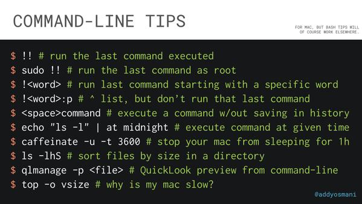

## bash 技巧 shell 技巧

### [bash 技巧，bash 历史命令查找](https://cyb.org.uk/2021/05/03/bash-productivity.html)

- 获取历史记录
  - history 命令，上下箭头，tab 键自动完成命令行
  - ctrl-r 命令搜索历史记录
- 使用 HISTIGNORE 从历史记录中删除无意义的命令

  - 一些 bash 命令用于提供一些即时信息，但不会改变您的环境，并且在您的历史记录中没有用。将 HISTIGNORE 变量添加到您的.bashrc 文件中，您可以选择要从历史记录中删除哪些独立命令。下面是一个例子：

  ```bash
  export HISTIGNORE='pwd:exit:fg:bg:top:clear:history:ls:uptime:df'
  ```

  - 如果您不希望某些敏感命令出现在您的历史记录中，例如，如果您在命令行上指定密码或 API 密钥，那么您可以使用以下选项来确保任何以空间没有出现在历史文件中：

  ```bash
  export HISTCONTROL=ignorespace
  ```

  - 这不是唯一的选项：例如，ignoredups 如果连续命令相同，则该选项将仅存储命令的一个副本

- !!命令会调用上一行(会执行，如果不需要执行则在命令行末尾使用:p)
  - !179(行号):p 显示具体的命令行但不执行
  - !ping 将运行最后一次 ping，!vim 运行最后一次 vim 命令
  - 如果你是一个真正厌恶风险的人，你可以跳过使用:p 并添加 shopt -s histverify 到你的.bashrc 文件中，每个扩展的命令 !都会在当前行被调用，但会等待你按回车键。
- 使用!$和!\*引用前一个命令的部分（而不是!!整个命令）
  - Using!$将扩展到最后一个命令的最后一个参数，这可以为您节省大量的输入或复制粘贴。例如，重命名一个文件，然后编辑它：
  ```bash
  $ mv list.txt items.txt
  $ vim !$
  vim items.txt
  $ cp !$ shopping.txt
  cp items.txt shopping.txt
  ```
  - 使用!\*将扩展上一行（即除第一个单词外的整行）上所有参数的值。不太常用的!$ ，我用不断，但仍然得心应手。在这个例子中，我们删除了一些日志文件，然后创建了相同文件的一些空版本：
  ```bash
  $ rm /var/log/httpd/access.log /var/log/httpd/error.log
  $ touch !*
  touch /var/log/httpd/access.log /var/log/httpd/error.log
  ```
- 用 ^ 替换上一行中匹配的单词
  - 该^符号允许您在切换匹配的单词后重复上一个命令。例如：
  ```bash
  $ rm /var/log/httpd/error.log
  $ ^error^access
  rm /var/log/httpd/access.log
  ```
- history | grep 关键字 可以模糊查找，精确很多
- 保存~/.bashrc 文件后，使用 source ~/.bashrc 可以重新加载新设置，或者再次注销/登陆

### [常用 shell 命令，常用 bash 命令，不需要 GUI，不需要界面操作](https://github.com/you-dont-need/You-Dont-Need-GUI#duplicate-a-file)

查找文件

查找当前目录下(包括子目录)文件名为icon-hy-add.svg的文件
find -type f -name "icon-hy-add.svg"


创建目录
$ mkdir 'untitled folder'
# or
$ mkdir -p 'path/may/not/exist/untitled\ folder'

创建文件
$ touch 'new file'    # updates the file's access and modification timestamp if it already exists
# or
$ > 'new file'        # note: erases the content if it already exists
or touch a/b/c.txt # 创建文件在a/b/目录下

拷贝文件夹或者文件
把a目录拷贝到b目录： 		cp -r a b or cp -a a b
把a目录下文件拷贝到b目录 	cp -r a/* b/

重命名文件夹
mv myMedia/ myMusic/
重命名文件
mv readme.txt README.md

移动目录
$ mv myMedia myMusic/
# or
$ mv myMedia/ myMusic/myMedia

移动目录下的文件
mv a/* b

删除当前目录下的所有文件
rm -rf ./*
删除多个文件
rm -rf ./temp/dialog/* ./temp3/dialog/*
删除多个目录
rm -rf temp temp3

More advanced:

```shell
$ cp readme{,.bak}.txt
# Note: learn how the {} works with touch foo{1,2,3}.txt and see what happens.
```

## merge directories

**STOP DRAG AND DROPPING TO MERGE DIRECTORIES** :-1:

```shell
$ rsync -a /images/ /images2/	# note: may over-write files with the same name, so be careful!
```


## show file/directory size

**STOP RIGHT CLICKING AND SHOW FILE/directory INFO** :-1:

```shell
$ du -sh node_modules/
```

## show file/directory info

**STOP RIGHT CLICKING AND SHOW FILE/DIRECTORY INFO** :-1:

```shell
$ stat -x readme.md   # on macOS
$ stat readme.md      # on Linux
```

## open a file with the default program

**STOP DOUBLE CLICKING ON A FILE** :-1:

```shell
$ xdg-open file   # on Linux
$ open file       # on MacOS
```

## zip a directory

**STOP RIGHT CLICKING AND COMPRESS DIRECTORY** :-1:

```shell
$ zip -r archive_name.zip folder_to_compress
```

## unzip a directory

**STOP RIGHT CLICKING AND UNCOMPRESS DIRECTORY** :-1:

```shell
$ unzip archive_name.zip
```

## peek files in a zip file

**STOP USING WinRAR** :-1:

```shell
$ zipinfo archive_name.zip
# or
$ unzip -l archive_name.zip
```


## list directory contents

**STOP OPENING YOUR FINDER OR FILE EXPLORER** :-1:

```shell
$ ls my_folder        # Simple
$ ls -la my_folder    # -l: show in list format. -a: show all files, including hidden. -la combines those options.
$ ls -alrth my_folder # -r: reverse output. -t: sort by time (modified). -h: output human-readable sizes.
```

## tree view a directory and its subdirectories

**STOP OPENING YOUR FINDER OR FILE EXPLORER** :-1:

```shell
$ tree                                                        # on Linux
$ find . -print | sed -e 's;[^/]*/;|____;g;s;____|; |;g'      # on MacOS
# Note: install homebrew (https://brew.sh) to be able to use (some) Linux utilities such as tree.
# brew install tree
```

## find a stale file

**STOP USING YOUR FILE EXPLORER TO FIND A FILE** :-1:

Find all files modified more than 5 days ago

```shell
$ find my_folder -mtime +5
```

## show a calendar

**STOP LOOKING UP WHAT THIS MONTH LOOKS LIKE BY CALENDAR WIDGETS** :-1:

Display a text calendar

```shell
$ cal
```

Display selected month and year calendar

```shell
$ cal 11 2018
```

## find a future date

**STOP USING WEBAPPS TO CALCULATE FUTURE DATES** :-1:

What is todays date?

```shell
$ date +%m/%d/%Y
```

What about a week from now?

```shell
$ date -d "+7 days"                                           # on Linux
$ date -j -v+7d                                               # on MacOS
```

## use a calculator

**STOP USING CALCULATOR WIDGET** :-1:

```shell
$ bc
```

## force quit a program

**STOP CTRL + ALT + DELETE and choose the program to kill** :-1:

```shell
$ killall program_name
```

## check server response

**STOP OPENING A BROWSER** :-1:

```shell
curl -i umair.surge.sh
# curl's -i (--include) option includes HTTP response headers in its output.
```

## view content of a file

**STOP DOUBLE CLICKING A FILE** :-1:

```shell
$ cat apps/settings.py
# if the file is too big to fit on one page, you can use a 'pager' (less) which shows you one page at a time.
$ less apps/settings.py
```

## search for a text

**STOP CMD/CTRL + F IN A DIRECTORY** :-1:

```shell
$ grep -i "Query" file.txt
```


## view an image

**STOP USING PREVIEW** :-1:

```shell
$ imgcat image.png
# Note: requires iTerm2 terminal.
```

## show disk size

**STOP RIGHT CLICKING DISK ICON OR OPENING DISK UTILITY** :-1:

```shell
$ df -h
```

## check performance of your computer

**STOP OPENING YOUR ACTIVITY MONITOR OR TASK MANAGER** :-1:

```shell
$ top
```

## Quick tips



## Hotkeys

```
Ctrl + A  Go to the beginning of the line you are currently typing on
Ctrl + E  Go to the end of the line you are currently typing on
Ctrl + L  Clears the Screen, similar to the clear command
Ctrl + U  Clears the line before the cursor position. If you are at the end of the line, clears the entire line.
Ctrl + H  Same as backspace
Ctrl + R  Lets you search through previously used commands
Ctrl + C  Kill whatever you are running
Ctrl + D  Exit the current shell
Ctrl + Z  Puts whatever you are running into a suspended background process. fg restores it.
Ctrl + W  Delete the word before the cursor
Ctrl + K  Clear the line after the cursor
Ctrl + T  Swap the last two characters before the cursor
Esc + T   Swap the last two words before the cursor
Alt + F   Move cursor forward one word on the current line
Alt + B   Move cursor backward one word on the current line
Tab       Auto-complete files and directory names
```

- 用指定程序打开文件
  ```shell
  open -a TextEdit [bus.js|readme.txt|...]
  ```


- 命令行参数，特殊字符，最后一个参数，所有参数
```bash
$ history
1 echo 1 2 3 4 5
2 ls 6 7 8 9 10
3 echo 11 12 13 14 15
4 cat 16 17 18 19 20
5 echo 21 22 23 24 25
```
- 命令（Event Designators），用 ! 开始一个历史展开。
```bash
$ !n                # 表示第n条命令，如!2表示执行ls 6 7 8 9 10
$ !-n               # 表示倒数第n条命令，如!-3表示执行echo 11 12 13 14 15
$ !!                # 表示上一条命令，是!-1的快捷方式
$ !string           # 表示以string开始的最近的一条命令，如!echo表示echo 21 22 23 24 25
$ !?string?         # 表示含有string的最近的一条命令，如!?6?表示cat 16 17 18 19 20
$ ^string1^string2^ # 表示执行上一条命令，并将其中的第一个string1替换为string2，如果string1不存在则替换失败，不会执行命令。
$ !#                # 表示当前命令现在已经输入的部分，如echo 1 2 !#会执行echo 1 2 echo 1 2
```
- 参数（Word Designators），命令中选取指定的参数，: 用于分割命令部分与参数部分。
```bash
$ !!:0              # 表示上一命令的第0个参数，即命令本身，得到的是echo
$ !2:n              # 表示第2个命令的第n个参数，如!2:2得到的是7
$ !!:^              # 表示上一命令第1个参数，可进一步简写为!^，与!!:1同义，得到的是21
$ !!:$              # 表示上一命令的最后一个参数，可进一步简写为!$，得到的是25
$ !!:x-y            # 表示第x到第y个参数，-y意为0-y，如!-2:3-4得到的是18 19
$ !!:*              # 表示上一命令的参数部分，可进一步简写为!*，如!!:*得到的是21 22 23 24 25
$ !!:n*             # 跟!!:n-$同义
$ !!:n-             # 意为!!:n-$-1，从第n个参数到倒数第二个参数，如!-2:3-得到的是18 19

$ mkdir somewhere/dir && cd !#:1          # 其中!#表示本行所有命令"mkdir somewhere/dir && cd”，:1取第一个参数就是目录名


```
```bash
    $_ 代表上一个命令的最后一个参数
    $# 参数个数。
    $0 当前 shell 名称（zsh or bash）或脚本的名字。
    $1 传递给该shell脚本的第一个参数。
    $2 传递给该shell脚本的第二个参数。
    $@ 表示所有的独立的参数，将各个参数分别加双引号返回。
    $* 以一对双引号给出参数列表。
    $$ 脚本运行的当前进程ID号或所在命令的PID。
    $? 显示最后命令的退出状态，0表示执行成功，其他表示失败。
    $! 代表最后执行的后台命令的PID
```
